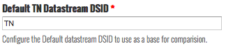
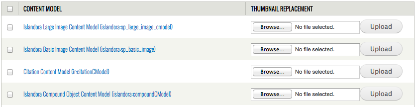
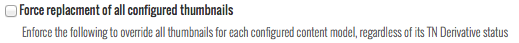
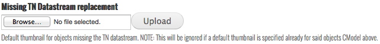
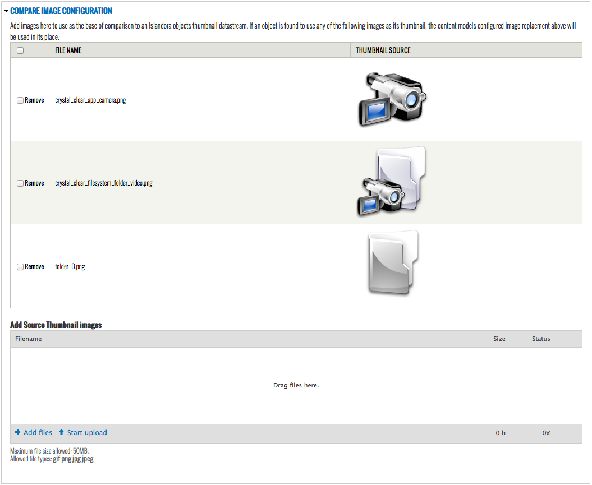

# Islandora Default Thumbnails

## Introduction

This module allows an administrative user to configure the default thumbnails found through the site. This functionality is non destructive to an existing objects thumbnail datastream, and will only affect the display layer thumbnails. This includes the Grid view, List view and SOLR Search results (SOLR Search results requires [This pull](https://github.com/Islandora/islandora_solr_search/pull/284) to function).

## Requirements

This module requires the following modules/libraries:

* [Islandora Solution Pack Collection](https://github.com/Islandora/islandora_solution_pack_collection)
* [Islandora](https://github.com/Islandora/islandora)
* [Islandora SOlR Search](https://github.com/Islandora/islandora_solr_search)
* [Plupload integration](https://www.drupal.org/project/plupload)

## Installation

Install as usual, see [this](https://drupal.org/documentation/install/modules-themes/modules-7) for further information.

## Configuration

This module is intended to allow the replacement of a solution packs provided default image, such as the folder.png provided by the [Islandora Solution Pack Collection](https://github.com/Islandora/islandora_solution_pack_collection/blob/7.x/images/folder.png). Instead of relying on each solution pack to provide its default thumbnail to this module, use the [Plupload](https://www.drupal.org/project/plupload) module integration to supply your own.

* After enabling this module, navigate to its configuration page ({YOUR_SITE}/admin/islandora/tools/islandora_default_thumb). Configure the default TN Datastream DSID for use with this module. Defaults to 'TN'.

* Select and upload an image to use as a thumbnail for objects of the specified content model. If the checkbox to the left of the content models name is not selected, it will not be used.

* Choose 'Force replacement of all configured thumbnails to force the display to use the configured thumbnail for every object with the corrisponding configured CModel, regardless of the thumbnails source.

* Configure the default missing thumbnail datastream replacement image. NOTE: This will be ignored if a default thumbnail is specified already for said objects CModel.

* Add source thumbnail images to be used as a base of comparison. Should any of the configured source thumbnails be found to be used by any configured content model on this modules configuration page, the configured content model image will be used in its place.

The configured thumbnail per content model will only ever be used if:

* The CModel default image is configured, selected and its current thumbnail datastream exactly matches one of the supplied Source Thumbnail images.

OR

* The CModel default image is configured, selected and 'Force replacement of all configured thumbnails' is selected.

## Troubleshooting/Issues

Having problems or solved a problem? Check out the Islandora google groups for a solution.

* [Islandora Group](https://groups.google.com/forum/?hl=en&fromgroups#!forum/islandora)
* [Islandora Dev Group](https://groups.google.com/forum/?hl=en&fromgroups#!forum/islandora-dev)

## Maintainers/Sponsors
Current maintainers:

* [Morgan Dawe](https://github.com/MorganDawe)

## Development

If you would like to contribute to this module, please check out [CONTRIBUTING.md](CONTRIBUTING.md). In addition, we have helpful [Documentation for Developers](https://github.com/Islandora/islandora/wiki#wiki-documentation-for-developers) info, as well as our [Developers](http://islandora.ca/developers) section on the [Islandora.ca](http://islandora.ca) site.

## License

[GPLv3](http://www.gnu.org/licenses/gpl-3.0.txt)
